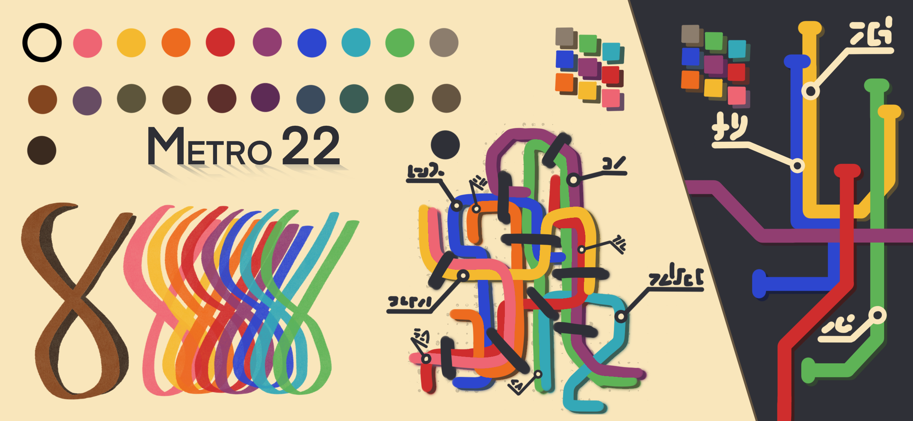
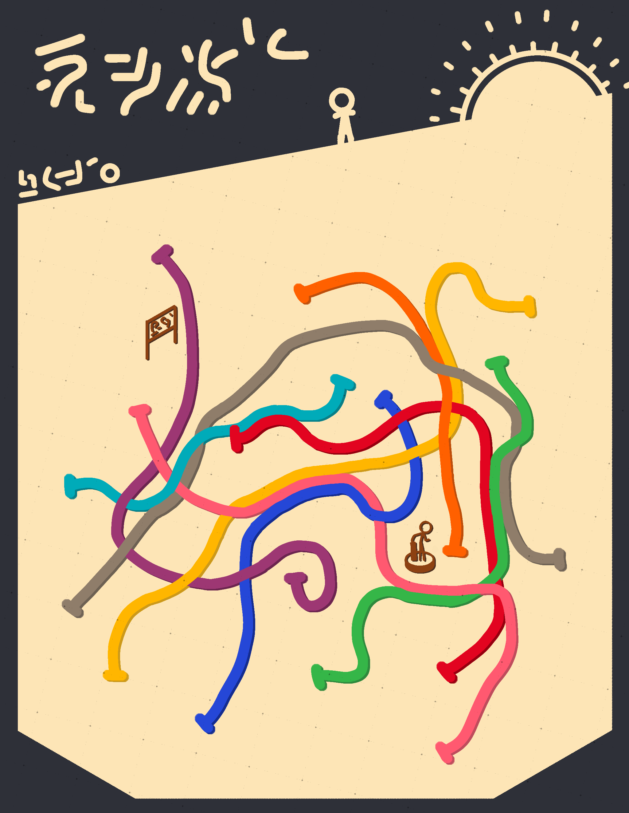

# ==Spunky The Hedge Hog’s Projects==

## Navigation

<u><a href="HomePage.html">Home</a></u> <a href="AboutPage.html">About</a> > <a href="ProjectsPage.html">Projects</a> <a href="ContactPage.html">Contacts</a>

## METRO 22

Metro 22 is a Color Palette based off of Metro Station Maps, 22 comes from the 22 colors in it.

Link to Colors’ Hex Values: <a href="Metro Station Colors\index.html">Metro 22</a>

## Placeholder for Project

Name:

Display:

URL:

## Placeholder for Project

Name:

Display:

URL:
